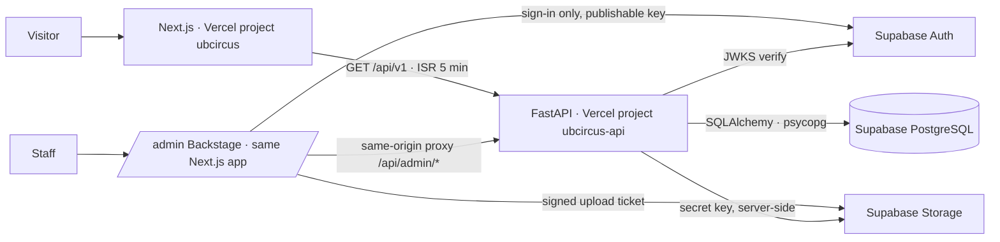

# UB CIRCUS — architecture

Greenfield monorepo. The previous Laravel site is intentionally excluded; nothing from it is ported.

## Runtime boundaries

**Next.js (apps/web)** renders the public site as static pages with Incremental Static Regeneration (`revalidate = 300`) per locale. The HTML hero (title, CTAs, 2D poster field) renders immediately; the WebGL orbit is a dynamically imported React Three Fiber scene that only mounts on capable desktops. Small client boundaries own the navigation dialog, the coverflow, What's On filters (state mirrored in the URL), the poster-first video player, filmstrips and the full-screen media viewer.

**Content provider** (`lib/content`) is one interface with two implementations:

| `CONTENT_MODE` | Provider | Used for |
| --- | --- | --- |
| `database` | `api.ts` → FastAPI `/api/v1/*` | production, previews with a database |
| anything else | `demo.ts` → `lib/content/demo.json` | local design work, previews without a database |

Both return the same shapes (`lib/content/types.ts`), which mirror the API's Pydantic `*Out` models exactly. In database mode failures surface as errors; sample content is never substituted silently. `generateStaticParams` for slugs only runs in demo mode; in database mode detail pages are generated on demand and cached.

**FastAPI (apps/api)** owns validation, sanitising (bleach), publishing state, sessions, media registration, rate limits, audit entries and role enforcement. Only published rows are exposed publicly. `/openapi.json` is the contract; `npm run api:types` turns it into `apps/web/lib/api/schema.d.ts`, which Backstage uses for every request and response.

## Authentication and authorisation

- Identity: Supabase Auth. Staff sign in at `/admin/login` (password or magic link) with the **publishable** key only.
- Authorisation: the server-managed `profiles` table (`admin` | `editor`, `active`). The API loads the profile for the token's `sub` on every request. `user_metadata` is never consulted. There is no public signup: profiles come from `POST /api/v1/admin/users/invite` (Supabase invite + profile) or `BOOTSTRAP_ADMIN_EMAILS` on first sign-in.
- Tokens: the API verifies Supabase JWTs against the project's JWKS (ES256/RS256), with an optional HS256 secret for legacy projects.
- Backstage never holds the API secret. Browser requests go to `/api/admin/*`, a same-origin Next route that reads the Supabase session cookie and forwards with `Authorization: Bearer`. `proxy.ts` keeps `/admin` private at the edge; the API remains the source of truth.
- Development: `DEV_AUTH_TOKEN` enables a static session in `ENVIRONMENT=development` only, and is refused when `VERCEL` is set.

## Media

Uploads never pass through a Vercel function. Backstage asks the API for a **signed upload ticket** (`POST /admin/media/upload-url`), `PUT`s the file straight to Supabase Storage, then `POST /admin/media/finalize` verifies the object exists, reads dimensions and registers the asset (alt/caption per locale, credit, photographer, focal point, category). The `media` bucket is public-read; only staff can write (storage policies use `public.is_staff()`).

## Caching

Public pages are static with ISR (5 min). `fetch` to the API is cached for 60 s. After every successful Backstage mutation the client calls `/api/admin-revalidate`, which runs `revalidatePath('/', 'layout')`, so edits appear immediately. Admin responses are `no-store`.

## Deployment shape

Two Vercel projects from one repository: `ubcircus` (Root Directory `apps/web`) and `ubcircus-api` (Root Directory `apps/api`, native FastAPI runtime, `app/main.py` entrypoint). Separate projects isolate Python dependencies, cold starts and rollbacks. Migrations run from a developer machine or CI with Alembic against the Supabase pooler, not from the function. See [DEPLOYMENT.md](DEPLOYMENT.md).

## Security summary

No public signup · staff roles admin/editor · JWT verified per request · profiles are the only authorisation source · CORS with explicit origins · rich text sanitised on write · ticket links must be `https://` · YouTube ids validated server-side · public contact form has a honeypot and database-backed rate limits · uploads limited by MIME allow-list and size · every public-schema table has RLS (see CONTENT_MODEL.md) · secret keys only in the API environment · security headers on both apps · `robots` disallow everything until `CONTENT_MODE=database`.
